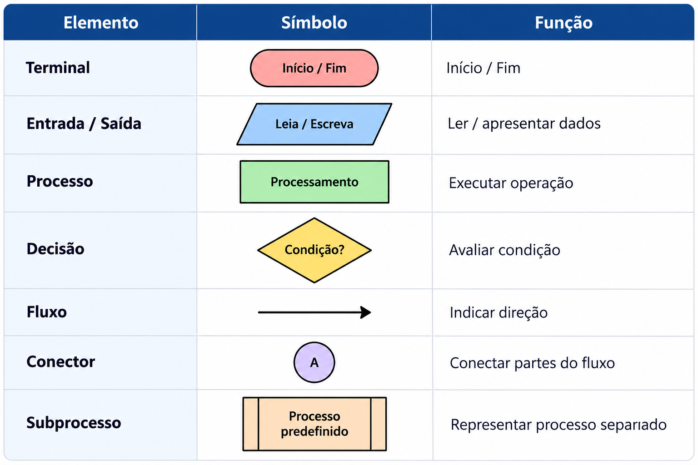

# 📖 Sintaxe de Fluxogramas

> Referência rápida dos símbolos e regras utilizados para representar algoritmos por meio de fluxogramas.

## 🎯 Objetivo

Aprender a representar visualmente um algoritmo utilizando símbolos gráficos, conectores e setas que indiquem o fluxo de execução.

O fluxograma deve representar a lógica do algoritmo de forma clara e organizada, sem depender de uma linguagem de programação específica.

---

## 🧠 Estrutura básica

Todo fluxograma possui um fluxo de execução:

```text
Início
   ↓
Entrada
   ↓
Processamento
   ↓
Saída
   ↓
Fim
````

Nem todo algoritmo terá exatamente essas etapas ou nessa quantidade, mas o fluxo deve possuir um ponto de início e um ponto de término.

* * *


## 🔷 Símbolos

### 🟢 1. Terminal — Início e Fim

Representa o início ou o término do algoritmo.

**Símbolo:**

```
   ╭──────────╮
   │  INÍCIO  │
   ╰──────────╯
```

Também pode representar:

```
   ╭──────────╮
   │   FIM    │
   ╰──────────╯
```

#### Utilização

```
Início
  ↓
...
  ↓
Fim
```

Um fluxograma normalmente possui:

-   Um ponto de início.
-   Um ponto de término.

* * *

### 📥 2. Entrada de dados

Representa dados fornecidos ao algoritmo.

**Símbolo:** paralelogramo.

```
    ╱──────────────╲
   ╱  Leia idade    ╲
   ╲                ╱
    ╲──────────────╱
```

#### Exemplos

```
Leia nome
Leia idade
Leia salário
Leia quantidade
```

#### Relação com o pseudocódigo

```
Pseudocódigo:
Leia idade
```

Fluxograma:

```
    ╱──────────────╲
   ╱  Leia idade    ╲
   ╲                ╱
    ╲──────────────╱
```

* * *

### 📤 3. Saída de dados

Também utiliza o **paralelogramo**.

Representa uma informação produzida ou apresentada pelo algoritmo.

```
    ╱────────────────╲
   ╱  Escreva média   ╲
   ╲                  ╱
    ╲────────────────╱
```

#### Exemplos

```
Escreva média
Escreva resultado
Escreva valor total
```

Entrada e saída utilizam o mesmo símbolo:

```
Entrada                 Saída

    ╱───────╲              ╱────────╲
   ╱  Leia   ╲            ╱ Escreva  ╲
   ╲         ╱            ╲          ╱
    ╲───────╱              ╲────────╱
```

* * *

### ⚙️ 4. Processamento

Representa uma operação realizada pelo algoritmo.

**Símbolo:** retângulo.

```
┌─────────────────────┐
│ média ← (n1+n2)/2   │
└─────────────────────┘
```

### Exemplos

```
total ← preço × quantidade

média ← (nota1 + nota2) / 2

salário ← salário + comissão
```

O processamento pode envolver:

-   Cálculos.
-   Atribuições.
-   Operações aritméticas.
-   Atualização de valores.

* * *

### 🔀 5. Decisão

Representa uma condição que pode gerar diferentes caminhos de execução.

**Símbolo:** losango.

```
             ╱─────────╲
            ╱  idade    ╲
           ╱  >= 18 ?    ╲
           ╲             ╱
            ╲───────────╱
              ↙       ↘
            Sim        Não
```

Uma decisão normalmente possui **dois ou mais caminhos de saída**.

#### Exemplo

```
        ┌───────────────┐
        │  Leia idade   │
        └───────┬───────┘
                ↓
          ╱───────────╲
         ╱ idade >= 18 ╲
         ╲     ?       ╱
          ╲───────────╱
           ↙         ↘
         Sim         Não
          ↓           ↓
     ┌─────────┐  ┌──────────┐
     │ Escreva │  │ Escreva  │
     │ Adulto  │  │ Menor    │
     └─────────┘  └──────────┘
```

* * *

### ➡️ 6. Linha de fluxo

Indica a direção em que o algoritmo deve ser executado.

```
┌─────────┐
│ Entrada │
└────┬────┘
     ↓
┌──────────────┐
│ Processamento│
└──────┬───────┘
       ↓
┌────────┐
│ Saída  │
└────────┘
```

As setas mostram:

```
de onde
   ↓
para onde
```

* * *

### 🔗 7. Conector

Utilizado para conectar partes do fluxograma quando uma linha direta prejudicaria a organização visual.

Exemplo:

```
      (A)
       ↓
      ...
       ↓
      (A)
       ↓
      ...
```

O mesmo identificador representa a continuidade do fluxo.

O conector é especialmente útil em fluxogramas grandes.

* * *

### 🔁 8. Repetição

Um fluxo de repetição ocorre quando uma parte do algoritmo precisa ser executada várias vezes.

A repetição é representada utilizando uma **decisão** para controlar a continuidade do fluxo.

Exemplo conceitual:

```
        ┌──────────────┐
        │ Inicialização│
        └──────┬───────┘
               ↓
          ╱──────────╲
         ╱ condição?  ╲
         ╲            ╱
          ╲──────────╱
           ↙        ↘
         Sim         Não
          ↓           ↓
    ┌────────────┐   Fim
    │ Processar  │
    └─────┬──────┘
          │
          └──────────────→ condição
```

O fluxo retorna para a condição enquanto ela for satisfeita.

* * *

### 🧩 9. Subprocesso

Representa uma parte do algoritmo que pode ser tratada separadamente.

É útil quando o fluxo possui uma operação ou processo que pode ser representado como uma unidade independente.

Conceitualmente:

```
┌────────────────────────┐
│     PROCESSO           │
│   CADASTRAR USUÁRIO    │
└────────────────────────┘
```

O subprocesso permite representar uma operação complexa sem detalhar todas as suas etapas no fluxograma principal.

* * *

## 📋 Regras de construção

### 1\. Comece pelo início

```
Início
  ↓
```

### 2\. Siga a sequência lógica

```
Entrada
   ↓
Processamento
   ↓
Saída
```

### 3\. Use setas para indicar o fluxo

O leitor deve conseguir acompanhar o algoritmo visualmente.

### 4\. Decisões devem possuir caminhos claramente identificados

```
        ╱────────╲
       ╱ condição ╲
       ╲    ?     ╱
        ╲────────╱
        ↙      ↘
      Sim       Não
```

### 5\. Evite cruzamento desnecessário de linhas

Quando o fluxograma ficar muito grande, utilize conectores para melhorar a organização.

### 6\. Mantenha o fluxo organizado

Sempre que possível:

```
        ↓
        ↓
        ↓
```

Evite:

```
↘      ↙
  ↘  ↙
   ↗
```

quando uma estrutura mais simples for possível.

* * *

## 🧠 Relação entre algoritmo e fluxograma

O mesmo algoritmo pode ser representado de diferentes formas.

### Problema

Calcular a média de duas notas.

### Pseudocódigo

```
Início

Leia nota1
Leia nota2

média ← (nota1 + nota2) / 2

Escreva média

Fim
```

### Fluxograma

```
       ╭─────────╮
       │ INÍCIO  │
       ╰────┬────╯
            ↓
     ╱──────────────╲
    ╱   Leia nota1   ╲
    ╲                ╱
     ╲──────┬───────╱
            ↓
     ╱──────────────╲
    ╱   Leia nota2   ╲
    ╲                ╱
     ╲──────┬───────╱
            ↓
   ┌──────────────────┐
   │ média ←           │
   │ (nota1+nota2)/2   │
   └────────┬─────────┘
            ↓
     ╱──────────────╲
    ╱  Escreva média ╲
    ╲                ╱
     ╲──────┬───────╱
            ↓
       ╭─────────╮
       │   FIM   │
       ╰─────────╯
```

## 📌 Referência rápida


